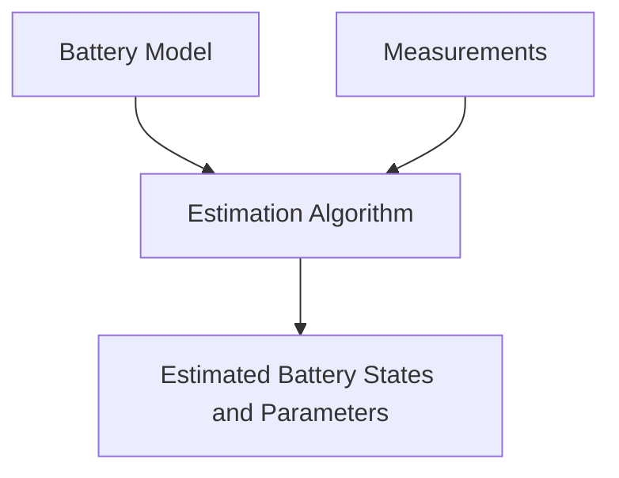

# BEAST Project History

**BEAST — Battery Estimation Algorithms and Simulation Toolkit** — has its
origins in academic research on lithium-ion battery modelling and state
estimation carried out at the **Università degli Studi di Salerno**.

The first implementations were developed during the Bachelor's Degree Thesis
in Electronic Engineering:

> **Hardware/Software Co-Design di uno stimatore dello stato di batterie agli ioni di litio**
> Salvatore Dello Iacono, Università degli Studi di Salerno, academic year
> 2012–2013.

The original work investigated the estimation of internal battery quantities
that cannot be measured directly during normal operation, with particular
attention to **State of Charge (SoC)** estimation and battery-model parameter
estimation.

## From battery models to estimation algorithms

The early work was based on **equivalent-circuit battery models**, where the
electrical behaviour of a lithium-ion cell is represented using an
open-circuit-voltage source together with resistive and capacitive elements.

These models provided the basis for experimenting with different state and
parameter estimation algorithms. The research progressively combined:

* equivalent-circuit modelling of lithium-ion cells;
* State of Charge estimation;
* battery-parameter estimation;
* Kalman-filter-based estimation techniques;
* numerical simulation and experimental-data processing;
* comparison of different model structures and estimator configurations.

An important objective from the beginning was not simply to implement a single
battery estimator, but to make it possible to evaluate different combinations
of **cell models** and **estimation algorithms**.

This separation between models and estimators eventually became one of the
central concepts of BEAST.

## MATLAB origins

Much of the original research and algorithm development was performed in
**MATLAB**.

MATLAB provided the environment used to develop models, implement estimation
algorithms, analyse experimental data, and compare simulation results. Over
time, this code grew into a collection of battery models, estimators,
simulation functions, numerical utilities, and experimental workflows.

That original software lineage is now preserved in
[`beast-mat`](https://github.com/delloiaconos/beast-mat).

Rather than treating the MATLAB code only as legacy software, BEAST keeps it
as a **reference implementation**. It documents how many of the models and
algorithms evolved and provides a useful baseline for validating newer
implementations.

## From simulation to embedded implementation

The original research also investigated how battery-estimation algorithms
could move beyond desktop simulation and execute on constrained hardware.

Parts of the estimation workflow were therefore implemented in **C/C++** and
used in a hardware/software co-design environment targeting an FPGA-based
**Nios II embedded processor**.

This work introduced concerns that remain relevant to BEAST today:

* computational efficiency;
* numerical implementation of estimation algorithms;
* separation between reusable algorithms and application-specific code;
* portability between simulation and real-time environments;
* suitability for embedded Battery Management Systems.

The coexistence of MATLAB simulation code and native implementations was an
early precursor of the multi-language structure used by the modern project.

## Evolution into BEAST

For several years, the different models, algorithms, experiments, and native
implementations primarily existed as research software.

The modern BEAST project was created to reorganize this work into a cleaner,
maintainable, and extensible software framework.

The name **BEAST** now stands for:

**Battery Estimation Algorithms Simulation Toolkit**

The emphasis on *Algorithms* reflects the central purpose of the project:
developing, studying, implementing, and comparing algorithms for battery state
and parameter estimation, together with the modelling and simulation
infrastructure required to evaluate them.

During this modernization, the original code base was progressively separated
into independent implementations:

* [`beast-mat`](https://github.com/delloiaconos/beast-mat) preserves the MATLAB
  research implementation and historical algorithm lineage;
* [`beast-py`](https://github.com/delloiaconos/beast-py) provides a Python and
  NumPy environment for simulation, numerical analysis, rapid experimentation,
  and algorithm development;
* [`beast-cpp`](https://github.com/delloiaconos/beast-cpp) provides a native
  C++ implementation focused on reusable components, efficient execution, and
  development toward embedded and real-time applications;
* [`beast`](https://github.com/delloiaconos/beast) acts as the common entry
  point for the project and hosts documentation shared by all implementations.

## One project, multiple implementations

BEAST is not intended to be a direct line-by-line translation of one code base
into several programming languages.

Each implementation has a different role and can use the architecture, data
structures, numerical libraries, and development practices that best fit its
environment.

They share the same conceptual foundation:

Maintaining independent implementations also makes it possible to
**cross-validate** models and algorithms between MATLAB, Python, and C++.

This helps identify implementation errors and distinguish numerical differences
from differences in the underlying mathematical formulation.

## Continuing development

BEAST continues the original research with a broader goal: to provide an open
and reusable environment in which battery models and estimation algorithms can
be implemented, compared, validated, and transferred between research,
simulation, and embedded applications.

Areas of continuing development include:

* additional equivalent-circuit battery models;
* State of Charge and State of Health estimation;
* joint and dual state/parameter estimation;
* parameter-identification techniques;
* temperature- and ageing-dependent models;
* validation against experimental battery datasets;
* numerical comparison across the MATLAB, Python, and C++ implementations;
* efficient implementations suitable for real-time and embedded systems.

Although its software architecture has changed considerably since the original
2012–2013 work, the central objective remains the same: **understand battery
behaviour through models and use estimation algorithms to infer internal
quantities that cannot be measured directly.**
