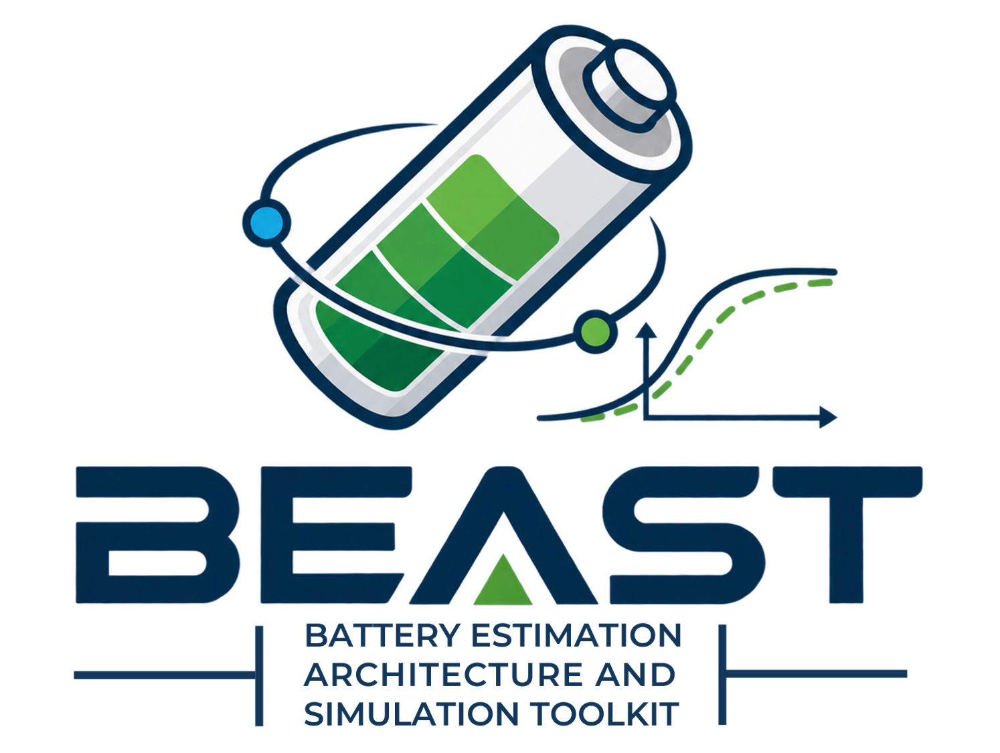
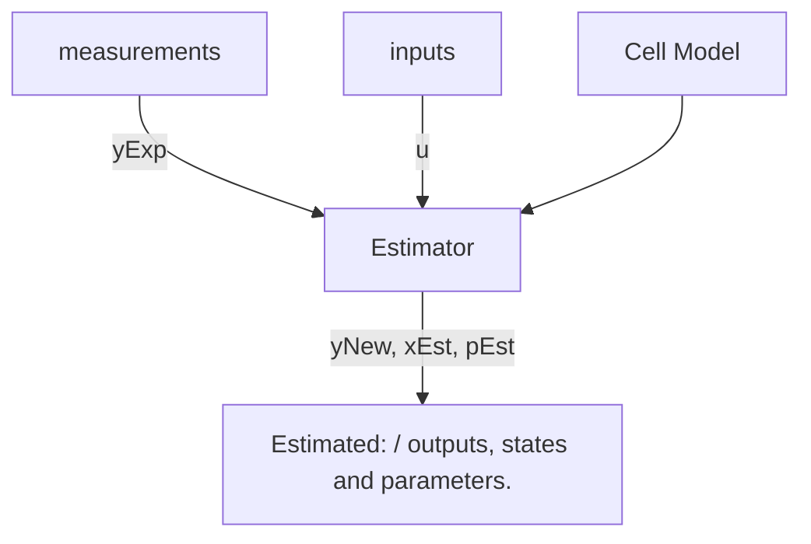

# BEAST — Battery Estimation Algorithms Simulation Toolkit



**BEAST** is a family of software projects for battery modelling, simulation,
state estimation, and parameter estimation.

The project provides a common architecture for combining battery models with
estimation algorithms while keeping the model and estimator implementations as
independent as possible. Its main focus is equivalent-circuit models of
lithium-ion cells and algorithms used in Battery Management Systems (BMS),
including State of Charge (SoC) and parameter estimation.

This repository is the **project-level entry point** for BEAST. It contains the
shared introduction, project history, model documentation, and links to the
language-specific implementations.

## Project repositories

| Repository | Implementation | Purpose |
| --- | --- | --- |
| [`beast`](https://github.com/delloiaconos/beast) | Project documentation | Shared BEAST documentation, history, model descriptions, and project resources |
| [`beast-cpp`](https://github.com/delloiaconos/beast-cpp) | C++ | Native implementation aimed at reusable, efficient, and embedded-oriented development |
| [`beast-py`](https://github.com/delloiaconos/beast-py) | Python | NumPy-based implementation for simulation, research, analysis, and rapid development |
| [`beast-mat`](https://github.com/delloiaconos/beast-mat) | MATLAB | MATLAB implementation preserving the original research code and serving as a reference implementation |

The repositories share the same conceptual model/estimator architecture, but
they are separate implementations. Features and supported models may therefore
differ between repositories.

## Project history

## Project history

BEAST originated from academic research on lithium-ion battery modelling and
state estimation and has since evolved into a multi-language toolkit for
battery estimation algorithms and simulation.

See [HISTORY.md](HISTORY.md) for the complete project history, its academic
origins, and the evolution of the MATLAB, and C++ implementations.

## Architecture

BEAST is organized around two principal concepts:

- **Cell models** describe the electrical and dynamic behaviour of the battery.
- **Estimators** use measurements together with a selected cell model to
  estimate internal states and, where applicable, model parameters.

The objective is to keep these components modular so that a model can be used
with different compatible estimators and an estimator can be evaluated with
different compatible models.

At a conceptual level:



Each language-specific repository implements this architecture using the
conventions and facilities appropriate to that language.

## Equivalent-circuit battery models

BEAST primarily works with **equivalent-circuit models (ECMs)**. These models
represent the electrical behaviour of a battery cell using an open-circuit
voltage source and a network of resistive and capacitive elements.

The exact state equations, parameterization, current sign convention, and model
names are defined by the individual BEAST implementations. Refer to the
implementation repository for the models currently available there.

### Model complexity

Increasing the number of RC branches normally improves the ability of an ECM
to reproduce dynamics occurring at different time scales, but it also increases
the number of states and parameters that must be identified or estimated.

BEAST is intended to make these models interchangeable at the architecture
level so that their effect on estimator behaviour can be compared consistently.

## Estimation

Battery states such as SoC are not measured directly during normal operation.
BEAST therefore combines a cell model with measured quantities such as current
and terminal voltage to estimate internal battery states.

The project also includes work on joint or dual estimation, where selected
model parameters can be estimated together with the battery state. The exact
estimators available are implementation-specific and documented in the
corresponding repository.

## Which implementation should I use?

Use **`beast-py`** when you want rapid experimentation, numerical analysis, data
processing, or a convenient research environment based on Python and NumPy.

Use **`beast-cpp`** when you want a native implementation, integration into C++
software, greater control over runtime behaviour, or development closer to an
embedded target.

Use **`beast-mat`** when you want to inspect or reproduce the MATLAB lineage of
the project, compare modern implementations with the original algorithms, or
work directly in MATLAB.


## Academic origin and acknowledgement

The original work was carried out at the **Università degli Studi di Salerno**.

Bachelor's thesis supervision:

- Prof. Walter Zamboni — Supervisor;
- Prof. Nicola Femia — Co-supervisor;
- Prof. Federico Baronti — Co-supervisor.

If BEAST, its models, or its estimation algorithms contribute to scientific or 
academic work, please acknowledge the project and cite the relevant repository 
and scientific sources.

## Contributing

Contributions are welcome across the BEAST project family. Areas of interest
include:

- additional equivalent-circuit models;
- temperature-dependent and hysteresis models;
- parameter-identification methods;
- additional state and parameter estimators;
- State of Health and ageing models;
- experiment-data import and processing;
- validation against public battery datasets;
- embedded-oriented numerical implementations;
- cross-validation between the C++, Python, and MATLAB implementations;
- documentation and examples.

Implementation-specific contributions should be opened in the corresponding
language repository.


## License

BEAST is open-source software. See the `LICENSE` file in each repository for the 
license terms that apply to that implementation.

This project is licensed under the **GNU General Public License version 3.0 
(GPL-3.0)** if not elsewhere specified.

Copyright © Salvatore Dello Iacono.

You are free to use, study, modify, and redistribute this software under the terms 
of the GNU General Public License, Version 3, dated 29 June 2007.

The full license terms are provided in the LICENSE file included with this and each 
repository.
This software is distributed in the hope that it will be useful, but WITHOUT ANY 
WARRANTY; without even the implied warranty of MERCHANTABILITY or FITNESS FOR A 
PARTICULAR PURPOSE. See the GNU General Public License for more details.

For more information about the GNU GPL v3.0, see the [`LICENSE`](LICENSE) file or 
visit GNU Project website.


## Academic Use and Citation 

If you use this software, its battery models, estimation algorithms, or results 
obtained with this framework in a scientific publication, thesis, report, or other 
academic work, please cite this repository and, when relevant to the algorithms or 
historical implementation, the original thesis and the scientific literature on which 
the implemented estimators are based.

See [`CITATION.cff`](CITATION.cff) for the preferred citation.

If you modify or extend the framework for scientific work, please clearly describe 
the modifications and cite the original project.


## Acknowledgements

The original research was conducted at the **Università degli Studi di Salerno**.

The foundational thesis is:
```
Salvatore Dello Iacono, "Hardware/Software Co-Design di uno stimatore dello stato di batterie agli ioni di litio," Bachelor's Degree Thesis in Electronic Engineering, Università degli Studi di Salerno, academic year 2012–2013.
```
Bachelor's thesis supervision:

- Prof. Walter Zamboni (Università degli Studi di Salerno)— Supervisor
- Prof. Nicola Femia (Università degli Studi di Salerno) — Co-supervisor
- Prof. Federico Baronti (Università di Pisa) — Co-supervisor

## Author

**Salvatore Dello Iacono**

BEAST — Battery Estimation Algorithms and Simulation Toolkit
